```{r setup, include=FALSE}
knitr::opts_chunk$set(echo = TRUE)
```

# Dataset Description
This data is from the Human Connectome Project (HCP). This project acquired a large amount of behavioral and neuroimaging data from each individual, in addition to recruiting a large amount of people (over 1000). In this workshop, we will be playing around with some of the behavioral data. 

The behavioral data from the HCP was been cut to only include a subset, and additional fake data was created to better represent a typical dataset that you might come across in your labs. The first column in the dataset shows the ID for each participant. IDs are used so that participants can be anonymous. The second column includes date of births (DOB). These DOBs are FAKE. It would be against HIPAA rules to share data with DOBs, as DOBs are considered identifiable (i.e. if I know your data of birth, I might be able to find out who you are). Other data that is included in this dataset are:

 - Testing date: the date on which participants completed the behavioral testing
 - Gender
 - MMSE: a neurocognitive test that measures cognitive impairement
 - PSQI: a behavioral test that measures sleep quality
 - WM_task: a behavioral task on working memory

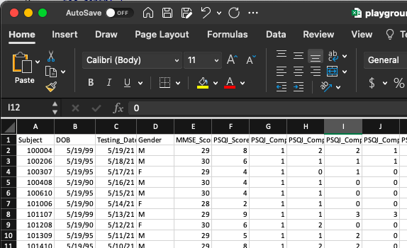


# Importing Data

Data files that labs work with are often stored in text files that end in .csv or .txt instead of in Excel spreadsheets. To open a .csv file in excel:

- Go to **File** > **Open** and browse to the location that contains your data file.
- Excel starts the Import Text Wizard (see screenshot). When you are done with the steps, click Finish to complete the import operation. For more information about the Import Text Wizard, check [here](https://support.microsoft.com/en-us/office/text-import-wizard-c5b02af6-fda1-4440-899f-f78bafe41857).
  - Data files are generally comma-delimited or tab-delimited.

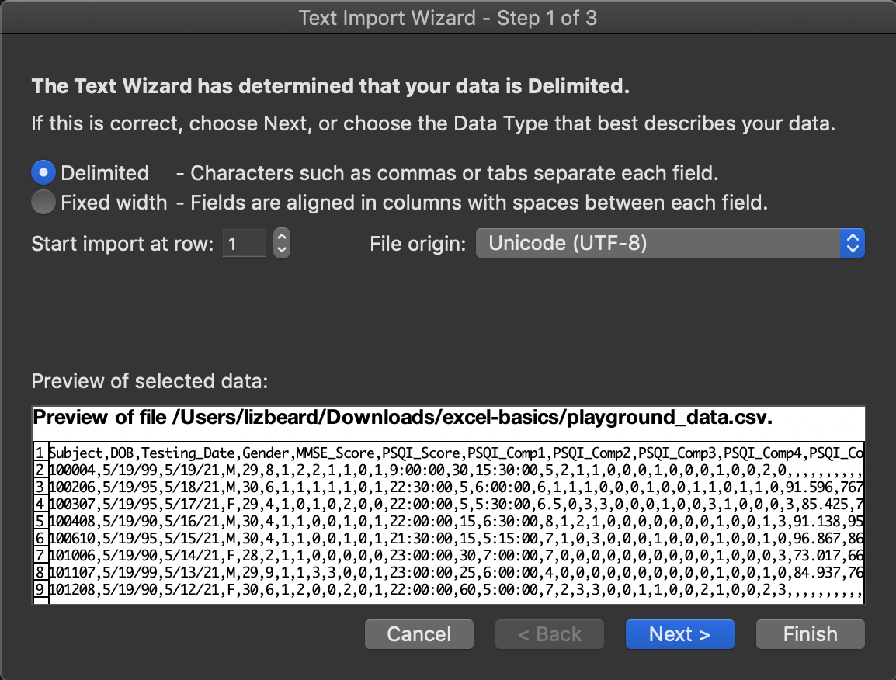


# Quality Control
Data is often outputted in a messy or inconvenient format. Sometimes we need to clean things up or make sure that our data is correct and/or makes sense. We will go over some quality control steps you can take to make sure your data is ready for analysis.

## Filtering
Filtering can be used in excel to select a subset of data based on certain criteria. To enable filters, you can select a column by clicking on the column index (i.e. column "D"). Click on column "D", then "Data" in the menu bar, then "Filter".

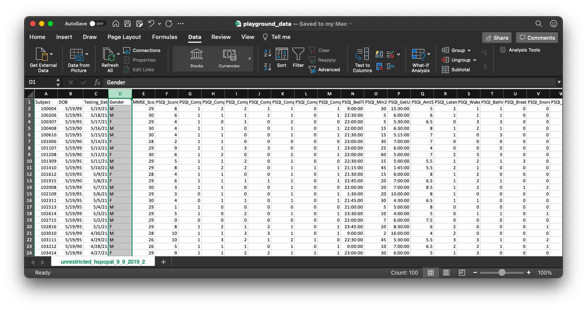
Now the "Gender" column has a filter which can be used to select only females ("F"), for example. 

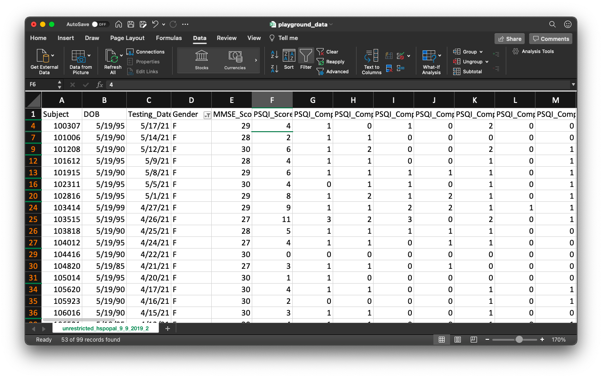
Notice that all of the rows are filtered so that only the rows that had an "F" in the "Gender" column are included. For the rest of the workshop, we will not need only data from females, so turn off the filter you just created.

You can also enable filters on all of the columns. This can be done by selecting the entire spreadsheet by clicking on the box in the top left corner of the spreadsheet. Once this is done, the entire spreadsheet will be highlighted. Then you can click "Data", and "Filter". Now each column can be filtered. 
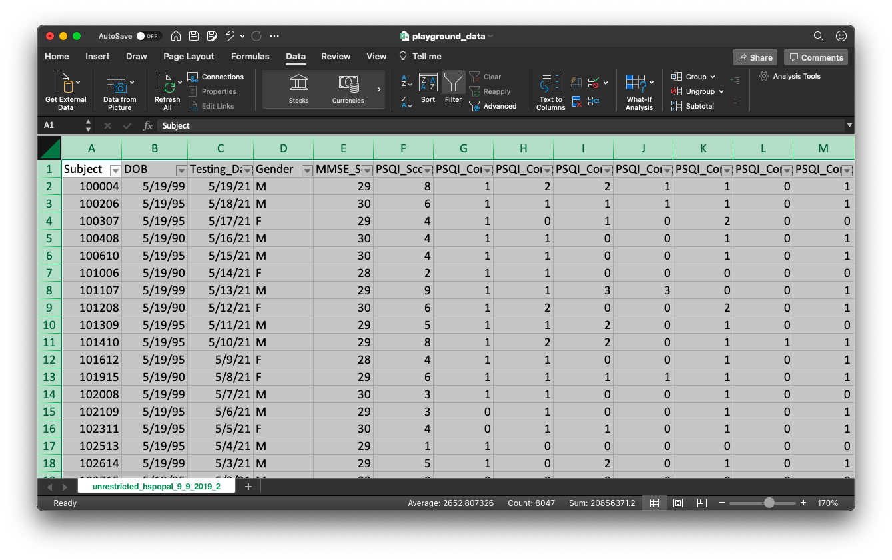
Multiple columns can be filtered at once. For example, you can create filters to only show a subset of data which includes females with MMSE scores higher than "28".


## Data formats
Data can come in a variety of formats. We can have text data, numerical data, data that indicates dates, etc. You can check the format of each of your data columns by looking at the "Number Format" box under the "Home" menu. Click on a cell in the "Subject" column and you will see that the format is "General". Click on a cell in the "DOB" column and you will see that the column is in "Date" format. Try changing the format of the "WM_Task_Acc" column to "Number". You will see that the numbers will change to only show two decimal places, although the original values are still saved (see the formula bar when click on a cell). The number of decimals that are displayed can be changed under the "Home" menu in the format section. 
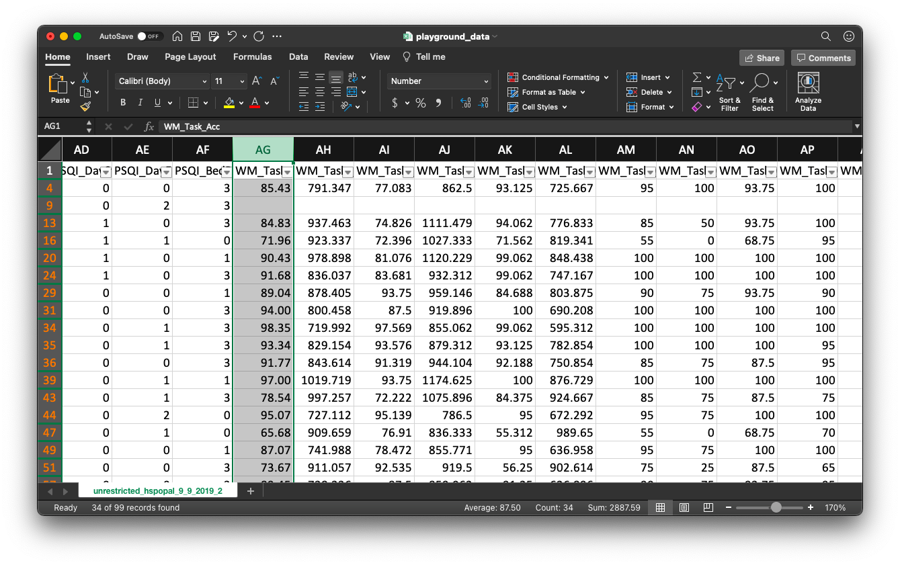


## Conditional formatting
Conditional formatting can be used to conveniently highlight certain cells. Cells can be manually highlighted, like you would highlight words in an Word document. But with conditional formatting, cells are highlighted based on whatever criteria you set. So if values in certain cells are changed, the highlighting is automatically updated. Try setting up a conditional format to highlight cells in which the "PSQI_Score" is above 5. You can do this by selecting the "PSQI_Score" column, click on "Conditional Formatting" under the "Home" menu, click "Highlight Cells Rules", "Greater Than...". In the box, enter 5, then click okay. Now cells in which there is a value greater than 5, will be highlighted. You can play around with the settings to change the colors, and area which is highlighted. For example, all rows in which there is a value freather than 5  in the "PSQI_Score" column can be highlighted. But in our simple example, try to manually change one of the cells in this column and see if the cell highlighting changes. 
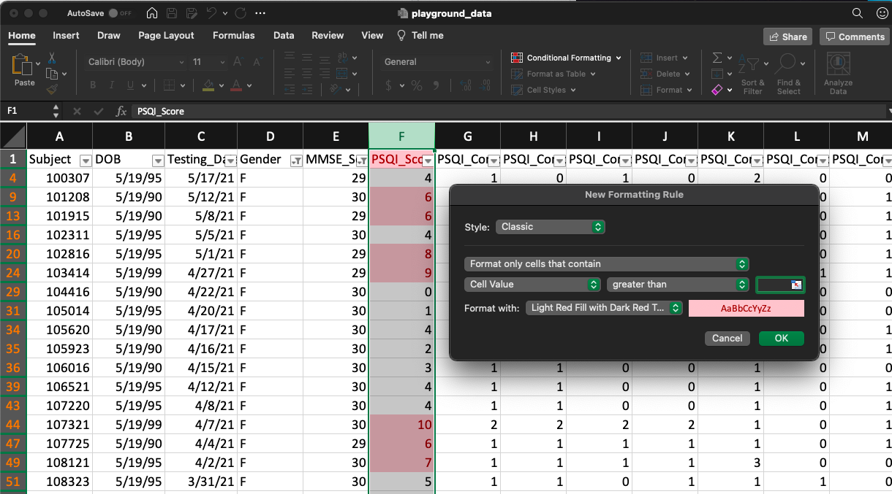

## Basic formulas
Turn off all filters and conditional formatting (if you are unsure how to do this, just close the spreadsheet without saving and reopen it). One of the most powerful features of excel, and under-used, is formulas. Formulas can be used to do something quickly, which might take much longer if done by hand. One thing we will try is to reverse score some data.

### Reverse scoring
Imagine that the values in the "PSQI_Comp1" column refer to the following conditions (they do not, but just play along):

- 0 = bad
- 1 = neutral
- 2 = good

The stupid program that outputted our data coded this question in a way that does not make sense for our analysis. Say that we want to calculate that overall quality of someone's sleep. In the 0-2 scale, it doesn't make much sense to have 1 be neutral. It would make more sense to have 0 be neutral, -1 be bad, and 1 be good. That way if we are given an average for all the participants as -0.5, we can easily tell that most people do not sleep well. We can use a formula to turn our 0s to -1s, our 1s to 0s, and our 2s to 1s. Insert a new column next to "PSQI_Comp1". Name the column "PSQI_Comp1_r", where the "r" stands for recoded. In the second cell of that column (row 2), type a formula using if statements to indicate that if a value is equal to X, change it to Y. 

> =IF(G2=1,0)

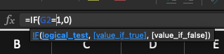
But, this formula will only change one of the values. Note that the syntax of this formal allows you to create a stipulation if your condition is false. We can use that to put an if statement within an if statement (i.e. if value is equal to 1, change it to 0, if value is not equal to 1 check if value is equal to 0, etc).

> =IF(G2=1,0,IF(G2=0,-1,IF(G2=2,1)))

Now that we have the entire formula, we can copy this formula for the entire column, where it will automatically update the relevant cells as it is copied down. This can be done by double-clicking the small square in the bottom right of the cell, once the cell is highlighted.
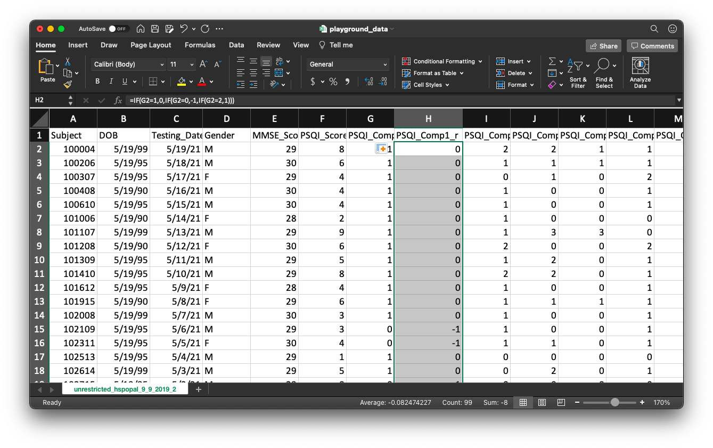


### Aggregating
Formulas can also be used to do basic operations like addition. In the example we below, we will add up the component PSQI scores using the SUM function. See if you can figure this one out by yourself. Add a new column next to the "PSQI_Score" column, and sum the PSQI component columns for a single row. Then copy that formula down to the rest of the rows. Hint: you can select a range of cells by highlighting them when defining the function.

### Checking your work
You can now use an if-statement to check whether your summation was done correctly. Tell the if statement to print a "" (blank) if there is a match, and "error" if there is no match. That way, you can easily spot which rows might of had an error. In the example below, I have changed one of the component scores (for example, if I had entered the data incorrectly, or changed the value by accident).

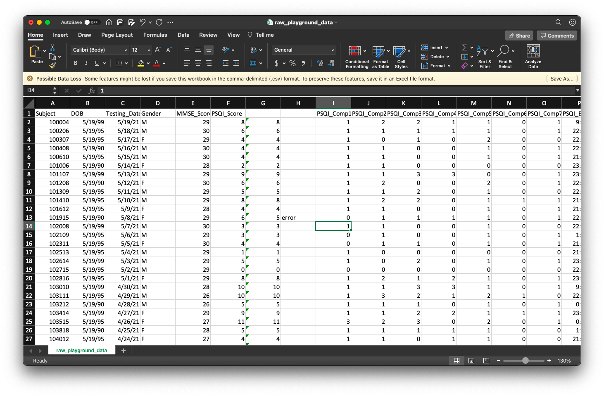


# Data Wrangling
A key part of data management and analysis is data wrangling. Data wrangling consists of cleaning, reformatting, and manipulating "raw" data into a desired format for specific analyses or visualization. 

## Inserting new data
There are a few different ways to insert new cells, rows, and columns into your data sheet.

- First, select a row, column, or cell *next to* where you would like to insert your data.
- On the **Home** tab, go to **insert**:
  - 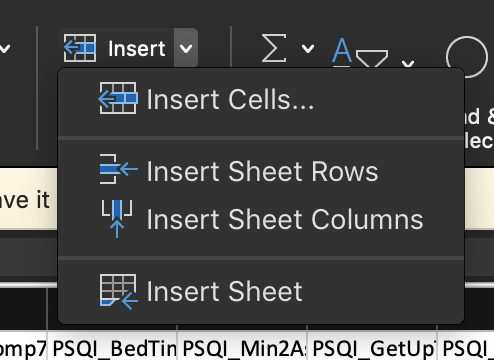
  - Select which object you would like to insert (column, cell, row).
    - Try to avoid inserting individual cells, as it will shift the data!

## Moving data
To move your data from one spreadsheet to another, or from one area of your spreadsheet to another:

- Highlight the row or column you want to move.
- Copy highlighted area (left-click, copy).
- Highlight the new row or column where you want to paste the data.
- Paste data into the new row or column.
  - Note: Be sure to select "Paste as Values" if you are copying data that was manipulated using conditional formatting or formulas, otherwise you will be pasting the formula itself into your new spreadsheet.
  
## Sorting data
To sort your data in a specific order (for example, from oldest to youngest participants):

- On the **Home** tab, go to **Sort & Filter** and select **Custom Sort**
- 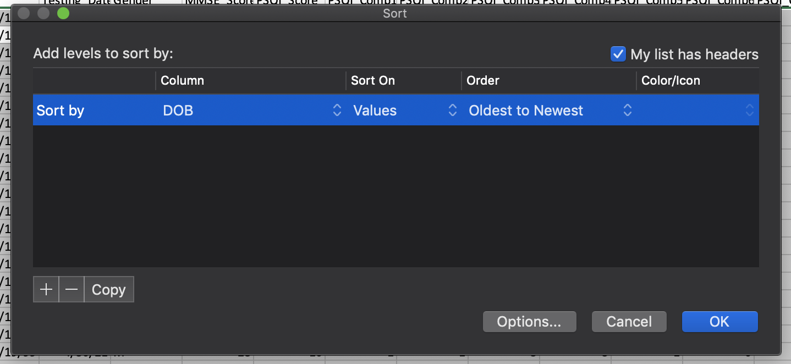
  - In the custom sort box, select the column you would like to sort your data by.
  - Select the order which you would like to sort your data.
    - These options will vary depending on what Number Format the column is set to (e.g., Dates sort by oldest to newest, numbers sort from smallest to largest, etc.).
- Note: if you have a column selected already, be sure to select 'Expand the selection' when the sort warning comes up. Otherwise, excel will only sort the column and your data will be shifted!

# Data Visualization
Data visualization, or creating graphical images using your data, is a critical component of presenting your data to an audience. It's also extremely helpful in understanding your data and interpreting your data.

Different graphs are useful for presenting different types of data. In the final section of this overview, we'll review two different types of graphs that may be of use to you. There are plenty of other types of graphs and charts you might find useful in the future, and a good primer on some charts can be found [here](https://medium.com/analytics-vidhya/data-visualization-guide-for-junior-data-scientists-a384f78ab023).

## Histograms
A histogram is a graphical display of the distribution of a given measure. It shows us the range and frequencies of different values in our measure. Let's say we wanted to examine the distribution of what time people go to bed in the evening.

- Select the measure (column) you want to visualize. In this example, we'll select the variable "PSQI_BedTime".
- On the **Insert** tab, select the histogram icon:
  - 
- You should see that a histogram has come up on top of your spreadsheet. It doesn't look like it's telling us too much information yet. It should look something like this:
  - 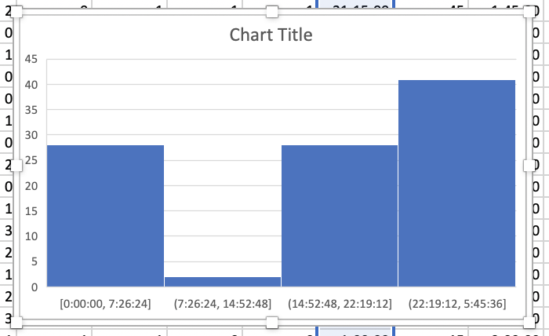
- Let's try and edit the histogram to be a bit more clear.
  - First we'll add more 'bins' to our histogram. This will give us a more detailled visualization of the data distribution. Our unformatted graph only has 4 'bins' and doesn't tell us very much. 
    - Hover over the 'bins' and left click, then select **Format Axis**.
    - 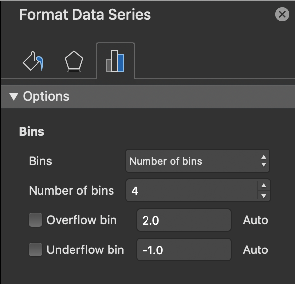
    - Change the **Bins** option from 'Auto' to 'Number of Bins'.
    - Set the number of bins to 7.
  - Doesn't that look better? Let's change the chart title to match the name of our measure so we know what we're looking at.
    - Doube click where it says "Chart Title"
    - Replace the text to "PSQI_BedTime"
    - Great! Let's take a look at our finished graph.
    - 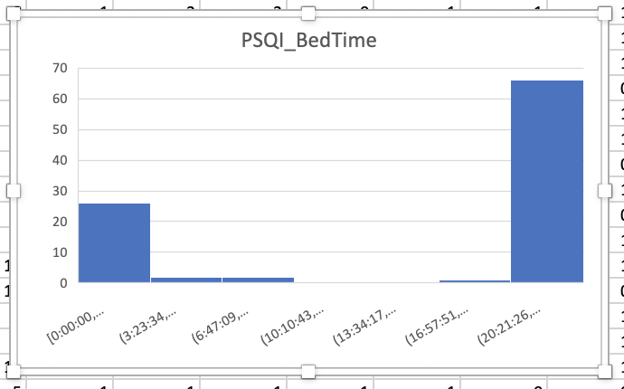
    - To save our graph as an image, left click the graph and select **Save as Picture...**

## Scatter plots
Scatter plots visualize the relationship between two different continuous measures. Let's examine the relationship between sleep quality (PSQI Score) and working memory (WM_Task_Acc).

- Select the measures (columns) you want to visualize. In this example, we'll select the variables "PSQI_Score" and "WM_Task_Acc".
  - To highlight two column that aren't next to one another, hold down the command key before selecting the second column (for PCs hold the Ctrl key)
- On the **Insert** tab, select the scatterplot icon:
  - 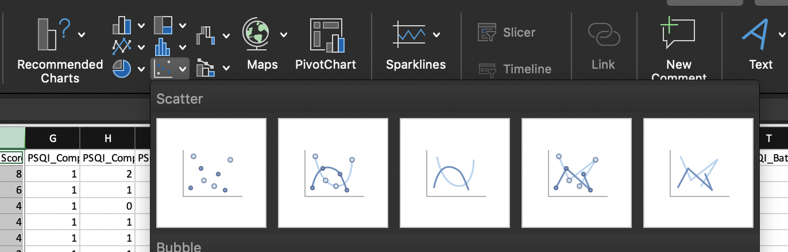
- Your scatterplot should look similar to this. Can you figure out how to add a label to the Y axis?
  - 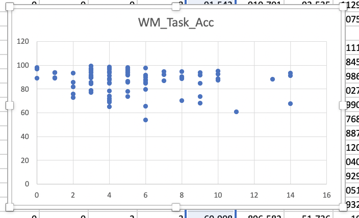

## Bar graphs
Bar graphs help visualize averages across different groups or over time. In this example, let's say we want to visually compare sleep quality as indexed by the PSQI between male and female participants.

- First we need to calculate the average PSQI scores for males and females.
  - To avoid selecting the wrong columns, let's copy the data we need into a new "sheet" in our excel file.
    - Create a new sheet by selecting **Insert** > **Sheet** > **New Sheet**.
    - Copy the 'Gender' and 'PSQI_Score' columns into the new sheet.
    - In another area of the sheet, we'll calculate the average sleep quality score for men and women separately using the AVERAGEIF.
      -  For men, use the following formula: 
        - `=AVERAGEIF(A2:A100, "=M", B2:B100)`
          - A2:A100 refers to the cells we want to assess (this is our gender column)
          - "=M" is the assessment criteria (does the values in A2:A100 = M?)
          - B2:B100 are the cells we want to average if the criteria is met
        - Can you do the same for women? (*hint*: we want "=W")
- Now, select averages and labels from the table we created.
  - 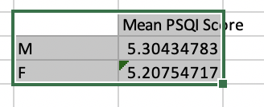
- On the **Insert** tab, select the bar graph icon and the graph you want to create. Your graph should look similar to the one we see below.
  - 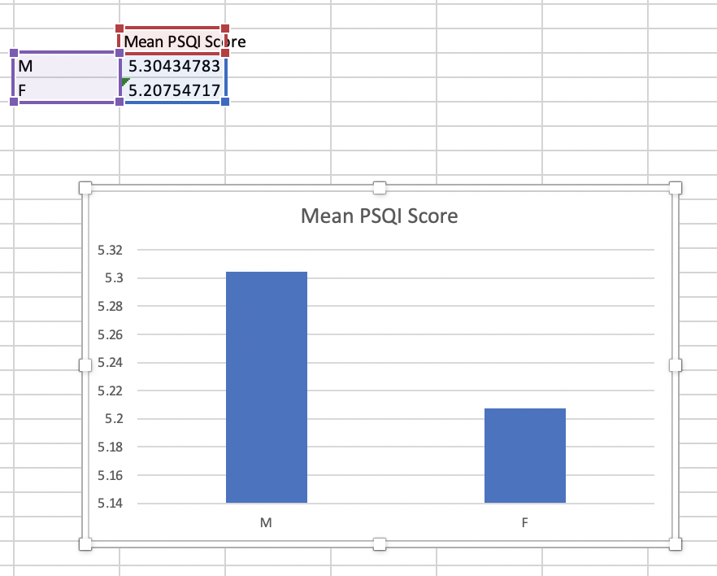
        


