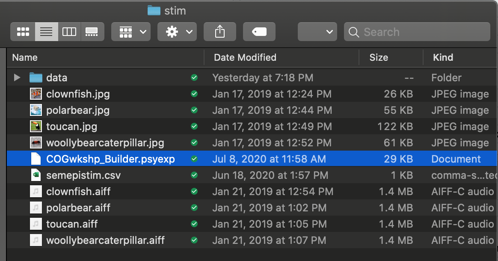
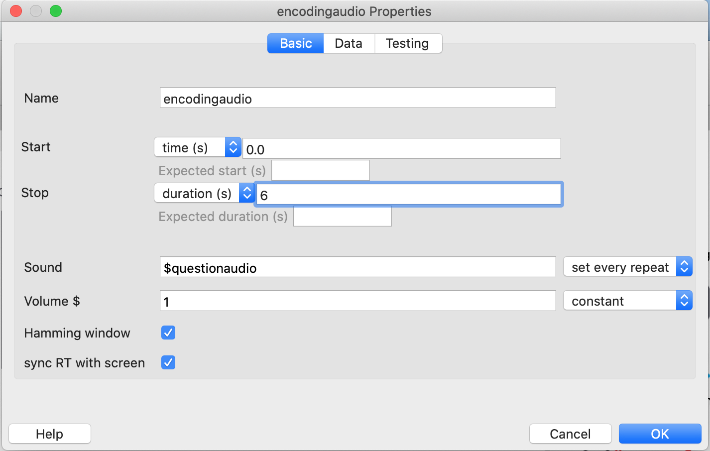
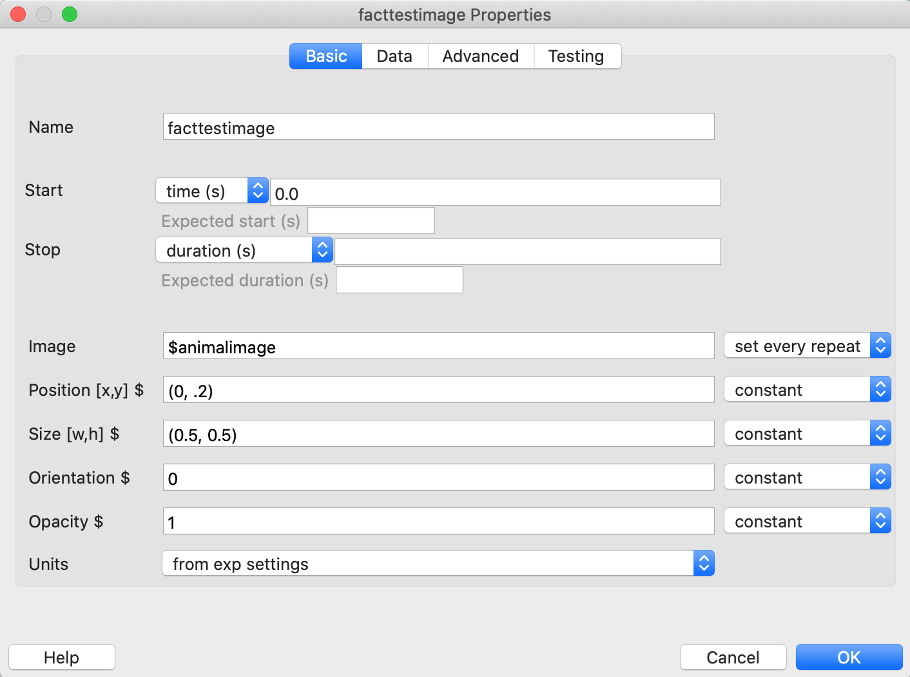
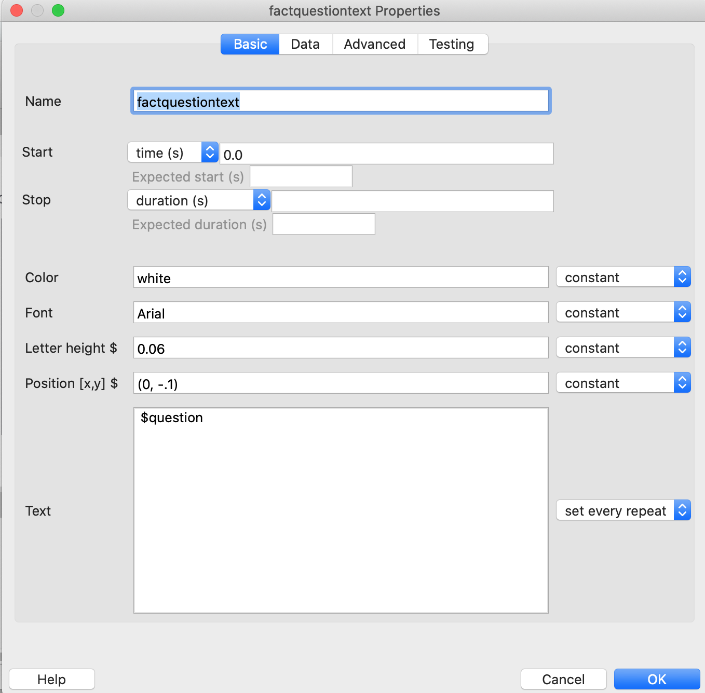
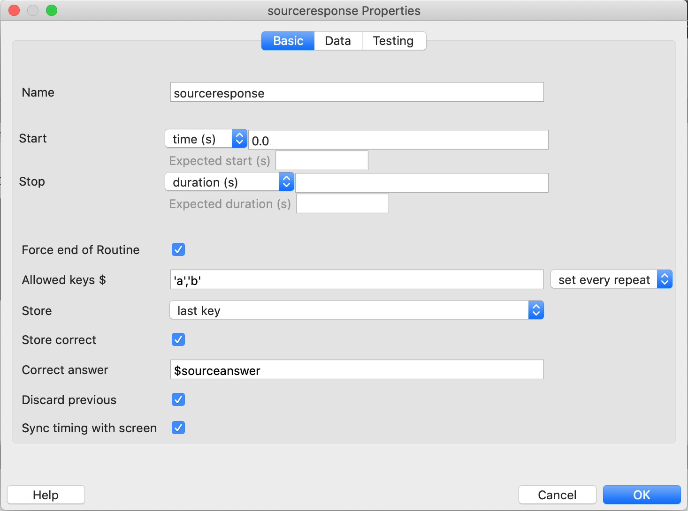

```{r setup, include=FALSE}
knitr::opts_chunk$set(echo = TRUE)
```

# Description

This workshop will cover how to use [PsychoPy](https://www.psychopy.org/index.html) to build psychological experiments using the Builder GUI. PsycoPy is a free, open-source software for people with and without coding experience and a good alternative to E-Prime. It is popular for psychology task creation and presentation, can be used in both behavioral and neuroimaging tasks, and supports online study capabilities.

## Outline

| Topic | Description | Time |
| --- | --- | --- |
| Intro | Set up. What is PsychoPy? Workshop overview. | 5 mins |
| Building your program | Creating routines: stimuli, presentation, loops, and responses | 25 mins |
| Viewing the data | Dealing with PsychoPy output | 10 mins |
| Pavlovia | Host your experiment online | 10 mins | 


# Intro

## Set Up & Prerequisites
Before the workshop:

1. Install standalone [PsychoPy](https://www.psychopy.org/download.html).

2. Download the 'stim' folder from the TU COG Github. This is the folder containing the necessary files for creating our example task.

3. Create an account on [Pavlovia](https://gitlab.pavlovia.org/users/sign_in), a site that hosts online experiments. PsychoPy tasks can be pushed directly to Pavlovia for online dissemination.


## Our Task

Now, let's watch the intro video and then get started on the workshop!
INSERT VIDEO HERE (I WILL SEND THIS BY TUESDAY)

Just to reiterate, today we will be creating a memory task in which participants will be presented with images of animals, and facts will be read to participants about those animals by two prerecorded voices (one defined as male, one as female). After all these are presented (this example task includes just four animals), we want to test participants' memory for both the facts and the source (voice) of those facts. Let's make this experiment!


## Getting Started
Once you've downloaded PsychoPy, click on the striped icon to open the program. (Sometimes you have to click it twice). Once you do, you should see this:

{width=80%}

This is the Builder GUI, from which we will be working.


### Directory Structure
Next, you want to save your PsychoPy program to the same folder where the stimuli and .csv file you downloaded from github are located. You can name it whatever you want (I named mine COGwkshp_Builder and it lives in the stim folder as well so you can use it as a comparison to check your work at the end of the workshop). Your experiment will have a .psyexp extension, and you will need to drag it from your directory to the striped PsychoPy icon to open it if you close it. Here's what your directory should look like, with your PsychoPy program saved directly into the stim directory:

{width=80%}


# Building Your Program

## Routine Basics
As I discussed in the video, all of the little bits of program you want to execute are called "routines." Let's delete the trial routine the template gave us. Right click it and select **remove**. Then we'll start by making a simple text presentation. To create a new routine, click **Insert Routine > new**, then name the routine whatever you want, then click where you want it to go. We can just put this one right on the line since it's our first routine:

{width=80%}

{width=80%}

Now, we want to actually add some text! Over on the right, select **Stimuli > Text**.

{width=80%}

A window should pop up that includes the box in which you can enter your text, as well as many variables. For this one, we can rename the stimuli to "introtext" and enter our desired intro text - I recommend including instructions for advancing to the next screen for participants. Then we can edit any of the other variables. I usually like to change my font color to black and the letter height to .05, but you can do whatever you want! Lastly, delete the "1.0" under "Duration" and leave it blank - this will leave the intro text up for an infinite amount of time or until we end the routine.


I also like to click the **Data** tab and deselect **save onset/offset times**, since RT for the intro is unimportant and creates unnecessary output in our data csv.


Click **ok**. Now let's add a key press to end the routine and advance to the next one so we don't get stuck on the intro screen for eternity. On the right, click **Responses** > **Keyboard**.

{width=80%}

Again, you can name this whatever you want and then adjust the parameters. I generally make the only allowed key be the space bar, and change duration to 3.0, so that participants have to wait 3s to click to advance and can't move on so quickly they don't actually read the intro. This key response isn't something we actually want data on, so next to **Store**, select **nothing** from the dropdown menu. Again, under the **Data** tab, I would deselect **save onset/offset times**.


## Routines for Presenting Stimuli
Now let's get started on the task! For this task, we want to present to participants an image of an animal, a text label of this animal's name, plus an audio recording of someone reading a fact about that animal. First, create a new routine called "Encoding" that comes after your intro routine. You will eventually have routines for image, sound, and text (all selected from Stimuli on the right), like this:


Let's start with the image. The only setting we'll change is to make the duration be 6s for the image presentation (this routine simply presents stimuli but doesn't collect responses; without a key press to advance, you have to select when the routine will end). Now, how do we get the image we want? That's where our stimuli .csv comes in handy! What we want is for PsychoPy to cycle through each of the images paired with its audio and text and then to move on to the memory test part of the experiment. So we enter a variable into the **Image** box denoted by a dollar sign, which must be named exactly as it is in the .csv - in this case, that would be $animalimage. We also need to select **set every repeat** from the dropdown to the right of this variable - this is super important, as leaving it "constant" will throw an error! It's basically telling the program to grab a different one of these variables for each iteration of the routine.


PsychoPy will find the column titled "animal image" in our .csv, use the name of each of the images in that column to pull the file from the directory of the same name (e.g. polarbear.jpg), and present that one for 6s, followed by all the others in order. 

Next, we'll add audio, change the duration, enter the variable, and select for it to set every repeat.



For the text, you'll want to enter the animal name text variable into the text box and select for it to set every repeat as well. I also made my letter height a bit smaller and moved the position up on the y-axis so it's above the image rather than covered up by it. 


## Loops
If we want our routine to cycle through the variables we have listed in our .csv, we have to add a loop to our routine so PsychoPy knows to repeat it until all of your stimuli have been presented. Down where the routines are, select **insert loop**, then click on the line before and after the encoding routine to tell the program you want the loop only to affect this routine. You want to set **nReps** (number of repetitions) to **1**, so that each animal is only presented one time (you can obviously set this to as many reps as you want depending on the requirements of your task). Last, click **browse** and select the stim .csv.


## Routines for Collecting Responses
Now that we'd presented all our animal facts to the participant, we want to see if they can remember each fact and remember which voice told them each fact. First, we'll create a routine called "FactTest". We want to present the animal name and image and ask a two-alternative forced choice memory question for that animal. This information is already in our .csv, so we just need to pull in all the variables.
For the image, we want to pull the $animalimage variable from our .csv again and set it to every repeat, as well as changing the positioning to be slightly above center on the y-axis so we can put the question text below it. For this design, we don't limit how long participants have to respond, so make sure all of these stimuli have an infinite duration (leave **Duration** blank).



For the question text, we want to pull the text under the question column in our .csv into PsychoPy and adjust the position and letter height.



For the fact text, I discovered that I couldn't simply type "a." and then list my variable for the option one choice presented, so I made a variable in my .csv that's just a column of a.'s and b.'s to get around this. Now two answers will be listed as options for each question, preceded by "a." or "b.". Make sure to change the position and letter height.


Lastly, we want to collect participant responses. We'll want to restrict their response options to "a" and "b" on the keyboard and store both their response (select **last key** from the drop down menu) and the correct answer variable from the .csv.


Now that we've asked participants about the animal facts, we want to test their source memory for which voice read them each fact. Let's create a new routine called "SourceTest" and add **Text** to it. This question doesn't need to be pulled as variables from the .csv because the question and answer choices are always the same. However, we still need to select **set every repeat** since each source question will be yoked to its corresponding fact question. Don't forget to change the letter height.


We also need to collect participant responses, again setting allowed keys to only a and b, and storing the participant's response as well as the correct answer for that question from the .csv.



Finally, we need to create a loop that encompasses both of these routines so that each repeat cycles through a fact question and its source question paired together. It should look like this:


...NReps should = 1 and the same .csv should be added in **Conditions**.


Last, you can create an **Exit** Routine that includes text thanking the participant and a button press that ends the routine and the experiment.


Now, you can click the **green play button** at the top of the GUI to run your experiment and test it out! If you want to quit the experiment, you can click the **Escape** key at any time.


# Viewing the Data
PsychoPy Builder output is pretty messy. I haven't found many ways to clean it up other than choosing not to save onset/offset times for stimulus presentation (this eliminates some unhelpful columns). I have, however gotten pretty good at interpreting the mess! In the stim folder, there is a folder titled **data** where all the output from your task will be sent. In this data folder, I have encluded an .xlsx version of the data .csv that I have color-coded and labeled to indicate what each column means. The column names PsychoPy generates are actually reasonably informative, just the format and unnecessary columns that are also included are a bit annoying.


# Pavlovia

## Sending Your Experiment to Pavlovia
Hopefully you've already created an account on Pavlovia. If so, you can send your task to Pavlovia where it can be run online.

First, click the **world icon with the green play button** over it.

{width=80%}

This window should pop up; click **create experiment.**

{width=80%}

Name your experiment and make sure "User" lists your username.


Summarize your changes however you see fit and then click **OK** to commit your experiment to Pavlovia.


Now, when you log into Pavlovia, you should see your experiment listed, with the status as "inactive."


## Compatibility with Pavlovia
So, the experiment as we've created it will throw an error and will not run as it is right now. This is because Pavlovia only accepts .mp3 audio files, but we are using .aiff audio files in PsychoPy (and PsychoPy does not accept .mp3 files). This is one of several compatibility issues between the two programs, because PsychoPy runs on python and Pavlovia runs on Javascript. The automatic conversion from one to the other in the Builder is generally quite good, but the stimuli do have to be in the right format for each to work, and sometimes these are not aligned.

Another note is that if you add in a code component or a fill-in-the-blank response collection, these often also lead to errors with compatibility. Without giving you exact examples, my suggestion is to Google it :) You can also reach out to me in the future if you're having trouble with this, as I might be able to talk you through your specific issue based on my prior experience.

Thanks for participating in this workshop!
